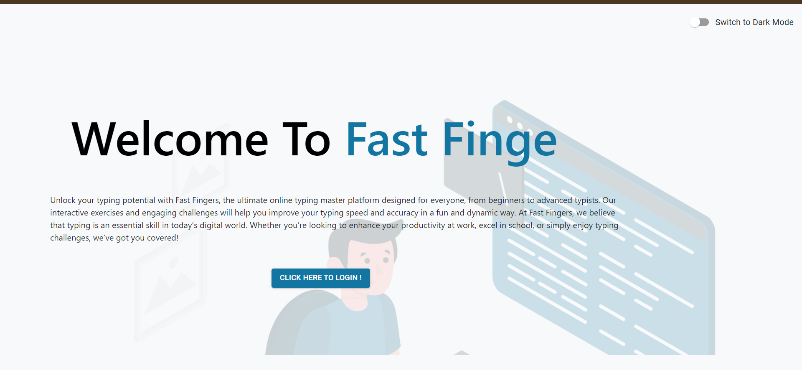
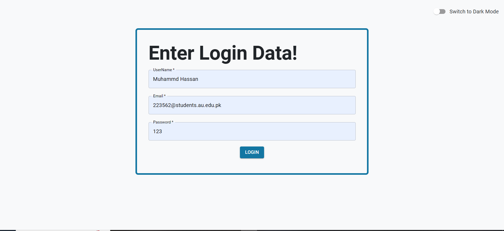
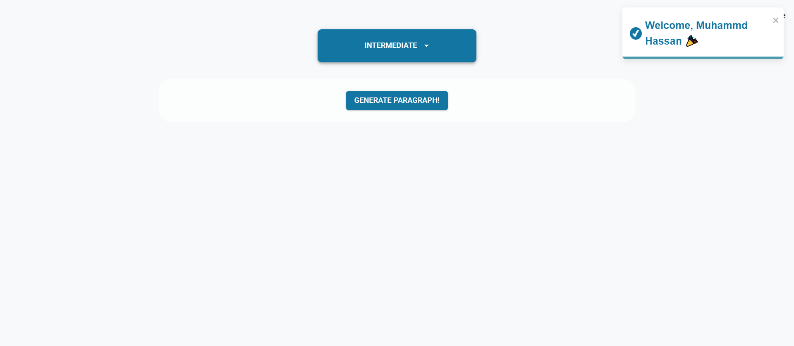
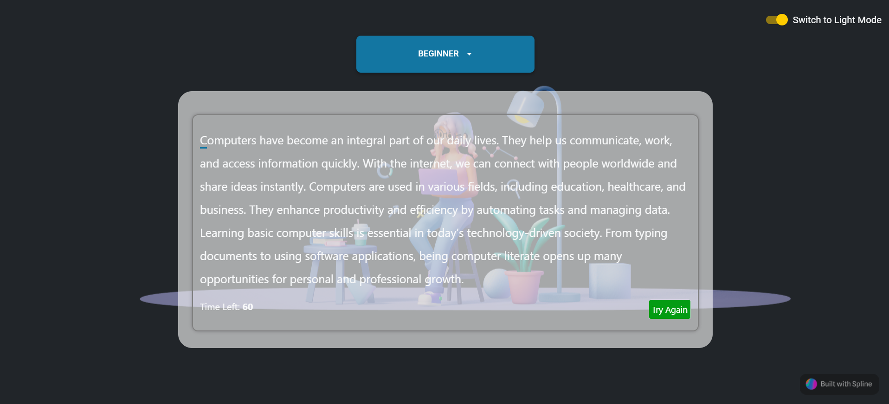
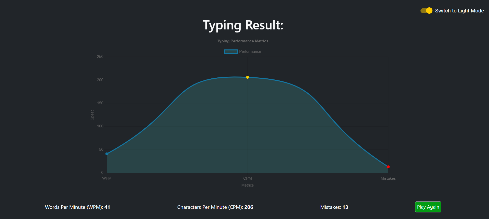

# Overview
Fast Finger is a Typing Master game created using React.js to help users improve their typing speed and accuracy. It features real-time typing performance metrics, including Words Per Minute (WPM), Characters Per Minute (CPM), and Mistakes counter. The game provides a countdown timer, live feedback, and visual analytics using interactive line charts powered by Chart.js.

# Features
## Real-Time Typing Metrics:
=> Characters Per Minute (CPM): Measures the number of characters typed in a minute.
=> Words Per Minute (WPM): Measures the number of words typed in a minute.
=> Mistakes Count: Tracks the number of typing mistakes made during the game.
=> Countdown Timer: Counts down the time left for the user to complete the typing test.
=> Performance Analysis: Displays a detailed analysis of the user's performance using interactive line charts.
=> Play Again Option: Allows users to reset and try again for better scores.

# Technologies Used
=> React.js: Core framework for building the front-end of the application.
=> React Router: For navigation between pages and managing routes.
=> Material-UI (MUI): For styling components and ensuring a responsive design.
=> Chart.js: For displaying performance metrics using line charts.
=> Spline: For integrating 3D elements to enhance visual appeal.

# Screen Shots:

